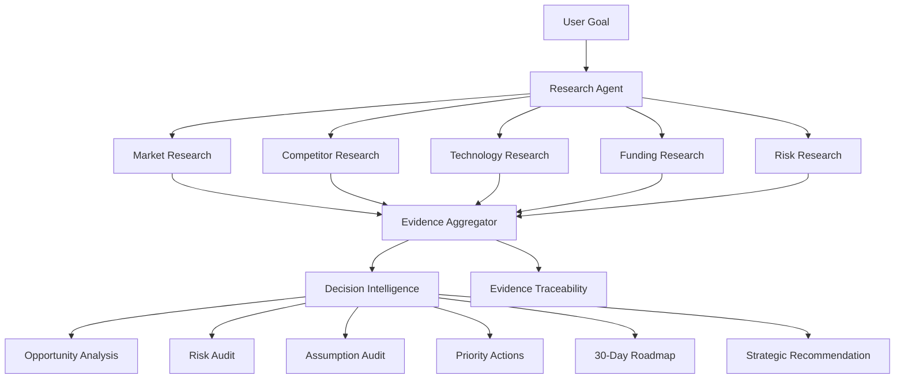

# 🤖 AgentHive-AI — Multi-Agent Decision Intelligence System

AgentHive-AI is a **modular AI-powered decision intelligence system** that transforms complex goals into structured, evidence-backed strategic recommendations.

Instead of relying on a single AI response, AgentHive separates the workflow into specialized stages:

**Research → Evidence → Analyze → Audit → Plan**

The system combines **live web research, evidence traceability, AI reasoning, risk analysis, assumption auditing, and strategic planning** in a single Streamlit application.

---

## 🚀 Why AgentHive?

Complex decisions often require more than generating an answer.

AgentHive is designed to answer:

* What does current external evidence suggest?
* Who are the competitors?
* What technologies and implementation approaches exist?
* What funding or business opportunities are relevant?
* What risks could prevent success?
* Which assumptions still need validation?
* What should be done next?

The goal is to turn scattered research into a **structured decision-making workflow**.

---

## 🧠 Agent Architecture



---

## 🔎 Research Pipeline

AgentHive automatically investigates five research dimensions:

| Dimension          | Purpose                                                           |
| ------------------ | ----------------------------------------------------------------- |
| 📈 **Market**      | Demand, trends, opportunities, customer needs                     |
| 🏢 **Competitors** | Existing companies, products, alternatives, differentiation       |
| ⚙️ **Technology**  | Technical trends, tools, platforms, implementation considerations |
| 💰 **Funding**     | Investment, grants, accelerators, partnerships                    |
| 🛡️ **Risks**      | Technical, market, competitive, regulatory, and execution risks   |

The research layer uses **live web search** and returns structured sources containing:

* Source title
* URL
* Evidence snippet
* Stable source identifier

---

## 🔗 Evidence Traceability

One of AgentHive's core design goals is **traceable reasoning**.

Each research source receives a stable identifier such as:

```text
Market Source 1
Competitors Source 2
Technology Source 3
Funding Source 1
Risks Source 4
```

The AI decision engine receives these sources directly and is instructed to reference them when making factual claims.

This creates an explicit relationship between:

**Research → Evidence → Reasoning → Decision**

The system also distinguishes between:

* **Evidence-backed findings**
* **Reasonable interpretations**
* **Assumptions requiring validation**

---

## 🧠 Decision Intelligence

AgentHive supports two execution modes.

### Gemini AI

Uses the Gemini API to synthesize collected research into an evidence-aware decision report.

The generated analysis includes:

### 🎯 Strategic Recommendation

One of:

* Proceed
* Proceed cautiously
* Validate further
* Avoid

### 🔎 Evidence Summary

Organized by the five research dimensions.

### 🚀 Opportunity Analysis

Separates evidence-backed opportunities from opportunities requiring further validation.

### 🛡️ Risk Audit

Analyzes:

* Technical risk
* Market risk
* Competitive risk
* Regulatory risk
* Execution risk

Each major risk is evaluated using:

**Risk → Evidence → Why it matters → Mitigation**

### 🧠 Assumption Audit

Identifies important assumptions and proposes ways to validate them.

### 📋 Priority Actions

Produces three concrete next actions.

### 🗓️ 30-Day Roadmap

Breaks execution into:

* Week 1 — Research & Validation
* Week 2 — Prototype
* Week 3 — Testing
* Week 4 — Evaluation

### 📊 Success Metrics

Suggests measurable indicators for evaluating progress.

---

## 🧪 Demo Mode & Automatic Fallback

AgentHive also includes a **Demo Mode**.

Demo Mode performs live web research without consuming Gemini API requests and generates a local evidence-based strategic analysis.

If Gemini becomes unavailable because of:

* API quota limits
* Missing API configuration
* API errors

AgentHive automatically falls back to Demo Mode.

This keeps the application usable even when the AI service is unavailable.

---

## 🛠️ Tech Stack

| Technology            | Purpose                       |
| --------------------- | ----------------------------- |
| **Python 3.12+**      | Core application              |
| **Streamlit**         | Interactive web interface     |
| **Google Gemini API** | AI-powered decision synthesis |
| **DDGS**              | Live web research             |
| **python-dotenv**     | Environment configuration     |
| **Pytest**            | Automated testing             |
| **GitHub Actions**    | Continuous Integration        |

---

## 📁 Project Structure

```text
AgentHive-AI/
│
├── .github/
│   └── workflows/
│       └── tests.yml
│
├── agents/
│   ├── __init__.py
│   ├── decision.py
│   ├── orchestrator.py
│   └── researcher.py
│
├── services/
│   ├── __init__.py
│   ├── gemini.py
│   └── search.py
│
├── tests/
│   └── test_pipeline.py
│
├── app.py
├── app_backup.py
├── debug_models.py
├── requirements.txt
├── .gitignore
└── README.md
```

### Responsibilities

**`agents/researcher.py`**

Handles research dimensions and source identification.

**`agents/decision.py`**

Handles evidence analysis, evidence digest generation, Demo Mode reasoning, and Gemini decision synthesis.

**`agents/orchestrator.py`**

Coordinates the overall AgentHive workflow.

**`services/search.py`**

Provides the web search service.

**`services/gemini.py`**

Handles Gemini configuration and AI generation utilities.

**`app.py`**

Provides the Streamlit application interface.

**`tests/test_pipeline.py`**

Contains automated tests for the research and evidence pipeline.

---

## 🧪 Testing & Continuous Integration

AgentHive includes automated tests using **Pytest**.

The repository also uses **GitHub Actions** to automatically run the test suite when changes are pushed or pull requests are created.

CI pipeline:

```text
Checkout Repository
        ↓
Set Up Python 3.12
        ↓
Install Dependencies
        ↓
Run Pytest
        ↓
Pass / Fail
```

This ensures that core functionality is automatically validated instead of relying only on manual testing.

---

## 💻 Local Setup

### 1. Clone the repository

```bash
git clone https://github.com/Adrija-dotcom/AgentHive-AI.git
cd AgentHive-AI
```

### 2. Create a virtual environment

```bash
python -m venv venv
```

Activate it on Windows:

```powershell
venv\Scripts\activate
```

### 3. Install dependencies

```bash
pip install -r requirements.txt
```

### 4. Configure Gemini

Create a `.env` file:

```text
GEMINI_API_KEY=your_api_key_here
```

**Never commit your API key to GitHub.**

The repository's `.gitignore` is configured to prevent `.env` files from being committed.

### 5. Run AgentHive

```bash
streamlit run app.py
```

The application will open in your browser.

---

## 🔐 Security Considerations

AgentHive is designed with basic secret-management practices:

* API keys are stored through environment variables.
* `.env` files are excluded from Git.
* Gemini credentials are not hard-coded into the application.
* External research is treated as evidence rather than automatically trusted truth.

For production deployment, additional controls such as secret managers, authentication, rate limiting, logging, and stronger source validation should be implemented.

---

## 🎯 Example Use Cases

AgentHive can be used for questions such as:

```text
Should I build an AI cybersecurity startup in India?

Should a startup expand into the US market?

Which technology stack should I choose for a new product?

Should a company build or buy a particular technology?

What are the risks of launching this product?

Which market opportunity should a startup prioritize?
```

The system is designed to work with **open-ended strategic goals**, rather than a fixed question-answer dataset.

---

## 🗺️ Development Roadmap

### ✅ Completed

* Modular agent architecture
* Live web research
* Five research dimensions
* Evidence traceability
* Gemini integration
* Demo Mode
* Automatic Gemini fallback
* Strategic recommendation generation
* Risk and assumption analysis
* Automated tests
* GitHub Actions CI

### 🔜 Future Improvements

* Persistent research history
* Source credibility scoring
* Multi-model reasoning
* Parallel agent execution
* Structured decision scoring
* User authentication
* Production deployment
* Database-backed research storage
* More comprehensive test coverage
* Observability and execution tracing

---

## 👩‍💻 Project

**AgentHive-AI**

Built as an AI/agentic systems project exploring how specialized research and reasoning components can work together to support complex decisions.

### Core Philosophy

```text
Research
   ↓
Evidence
   ↓
Analyze
   ↓
Audit
   ↓
Plan
   ↓
Decide
```

> **Don't just generate an answer. Build an evidence-backed decision process.**
